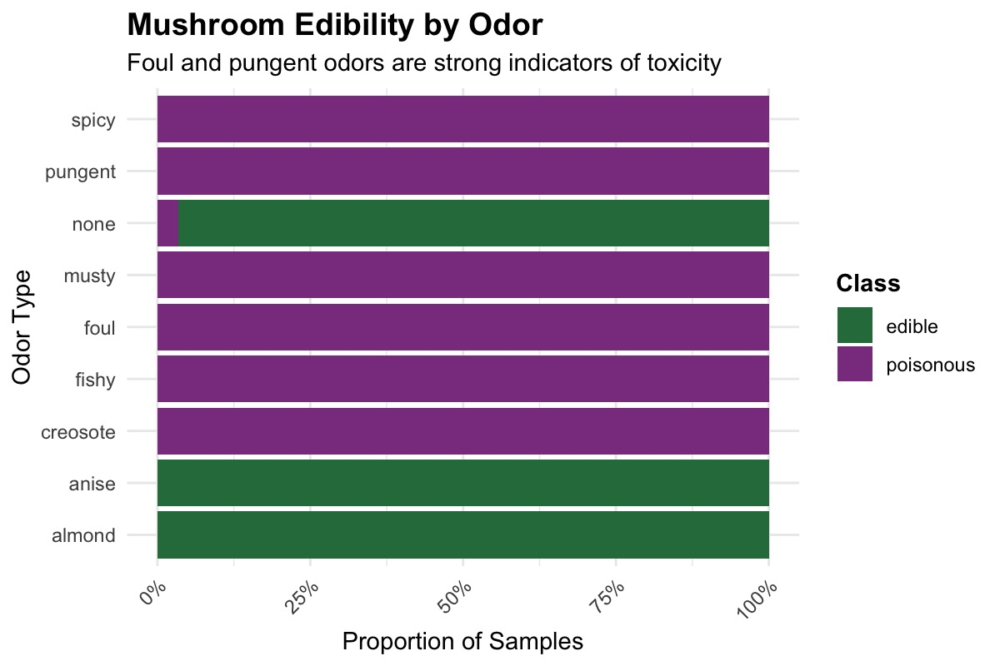

# Project Title: Exploratory Data Analysis of Mushroom Classification

A data analysis project that investigates patterns in mushroom characteristics to understand which features are most associated with edible vs. poisonous mushrooms.

## Overview

This project explores the Mushroom (Agaricus-Lepiota) dataset using Exploratory Data Analysis (EDA) to identify relationships between physical mushroom features (such as cap shape, odor, gill color, and bruising) and their classification as edible or poisonous.

Using R and tools from the tidyverse ecosystem, we clean, analyze, and visualize the dataset to uncover meaningful patterns. Our goal is not to build predictive models, but to understand which observable traits are the strongest indicators of toxicity and to communicate these insights through a reproducible Quarto report.

### Interesting Insight (Optional)

One of the most significant findings from our analysis is that odor is the strongest predictor of mushroom toxicity. Mushrooms with foul, pungent, or fishy odors are highly associated with poisonous classes, while those with almond, anise, or no odor are more likely to be edible.



## Data Sources and Acknowledgements

Primary Dataset:
Mushroom Dataset (Agaricus–Lepiota) from the UCI Machine Learning Repository
Contains 8,124 observations and 22 categorical attributes describing mushroom characteristics

Class label: edible (e) or poisonous (p)

Data Description:
Observations are derived from field guide descriptions of real mushroom species in the Agaricus and Lepiota families

Features include:
Cap shape, surface, and color
Odor
Gill size, spacing, and color
Bruising
Habitat and population
Spore print color

Dataset Formatting Details:
All variables are encoded using single-character categorical codes to reduce file size and improve efficiency
Attribute meanings are defined in a dataset dictionary and must be decoded before analysis

Acknowledgements:
Dataset originally donated by Jeff Schlimmer
Replacement and distribution supported by Wayne Iba
Documentation and maintenance by David W. Aha, who noted dataset revisions, formatting updates, and distribution issues

## Current Plan
Our project follows a structured, step-by-step workflow, combining data analysis, visualization, and collaborative version control:

1. Dataset Understanding
- Review dataset documentation and attribute dictionary
- Decode categorical variables (e.g., cap shape, odor, gill color)
- Understand class labels (edible vs. poisonous)

2. Research Question Definition
Identify key analytical questions, including:
- Which features are the strongest predictors of toxicity?
- How do feature distributions differ between edible and poisonous mushrooms?
- Which combinations of traits provide the most insight?

3. GitHub Collaboration Setup
- Create a shared repository
- Assign roles and responsibilities
- 
Use:
- Branching to isolate work
- Commits for version tracking
- Pull requests for peer review

4. Data Import and Cleaning
- Load raw dataset into R
- Perform preprocessing using dplyr and tidyr:
- Handle missing or ambiguous values
- Convert variables into appropriate data types (factors)
- Recode categorical values for interpretability


5. Data Validation
- Cross-check cleaned dataset
- Ensure consistency, accuracy, and readiness for analysis


6. Exploratory Data Analysis (EDA)
- Compute summary statistics:
- Frequency distributions of features
- Class balance (edible vs. poisonous)
- Analyze relationships between variables and class label


7. Pattern Identification
- Compare features to identify strong associations with toxicity
- Highlight key indicators such as:
Odor
Gill color
Bruising
Spore print color


8. Visualization Design and Development
- Establish consistent design standards (colors, themes, labels)
- Create visualizations using ggplot2:
- Bar charts
- Comparative plots
- Heatmaps (if applicable)
- Refine plots with clear titles, legends, and annotations


9. Interpretation and Storytelling
- Collaboratively interpret visual findings
- Write clear explanations of observed patterns
- Connect visual insights to research questions


10. Report Construction (Quarto)
- Integrate code, outputs, and narrative into a .qmd file
- Ensure reproducibility of analysis


11. Final Output Generation
- Render report into a PDF document
- Verify formatting, clarity, and completeness


12. Version Control and Quality Assurance
- Use GitHub workflows:
Feature branches
Pull requests for peer review
- Conduct final checks:
- Code correctness
- Documentation completeness
- Repository organization


13. Team Coordination
- Maintain regular communication
- Attend scheduled classes and meetings
- Ensure equal contribution across team members


## Repo Structure

```
  ├── data/                          # Dataset files (raw and/or processed)
  ├── plots/                         # Folder containing all generated visualizations
  ├── Final_visualiztions/           # Consolidated final visual outputs for analysis
  ├── Data_Cleaning.R                # Script for data cleaning and preprocessing
  ├── summarystat_analysis_visuals.R # Script combining summary statistics and visualizations
  ├── linting_script.R               # Code quality and linting checks
  ├── Mushroom_project.qmd           # Main Quarto report file
  ├── Project Plan                   # Detailed project planning document
  ├── Project_Guidelines.md          # Guidelines and requirements for the project
  ├── README.md                      # Project documentation
  ├── .gitignore                     # Specifies files ignored by Git
  ├── .gitattributes                 # Git configuration for file handling
  ├── .lintr                         # Linting rules for R code
  ├── MLA9.csl                       # Citation style file (MLA format)
  └── apa7.csl                       # Citation style file (APA format)
```

Key Files
- Data_Cleaning.R → Handles dataset import, cleaning, recoding of categorical variables, and formatting for analysis
- summarystat_analysis_visuals.R → Performs exploratory data analysis, computes summary statistics, and generates visualizations
- Mushroom_project.qmd → Main Quarto document integrating code, analysis, and narrative into a reproducible report
- plots/ → Stores all individual plots created during the analysis process
- Final_visualiztions/ → Contains finalized and refined visual outputs used in the report
- Project Plan → Describes the full workflow, task division, and methodology followed by the team
- Project_Guidelines.md → Provides project requirements and expectations
- linting_script.R & .lintr → Ensure consistent coding style and quality across the project
- MLA9.csl & apa7.csl → Citation style files used in the Quarto report for formatting references


## Authors

- Anchita Mitra – Summary statistics, visualizations, pattern analysis
- Fatmah – Data import, cleaning, variable recoding, documentation review
- Heet – Report writing, data provenance, conclusions, formatting
